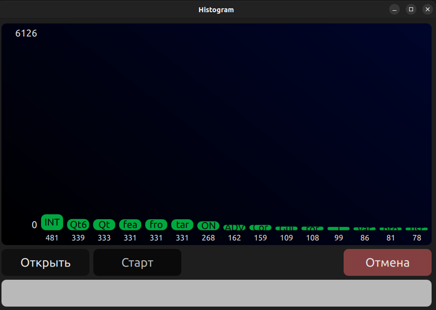

#### Приложение на Qt с использованием QML, которое считывает слова из файла и выводит топ 15 слов (по количеству вхождений) в режиме реального времени в виде гистограммы

##### Dependencies:
- Qt v6.2
- CMake v3.21
- Doxygen v1.9

##### Build:
```
mkdir build && cd build
cmake -DCMAKE_BUILD_TYPE=Release ..
cmake --build .
```

##### Docs:
- https://notzahar.github.io/histogram/

##### Demo:

